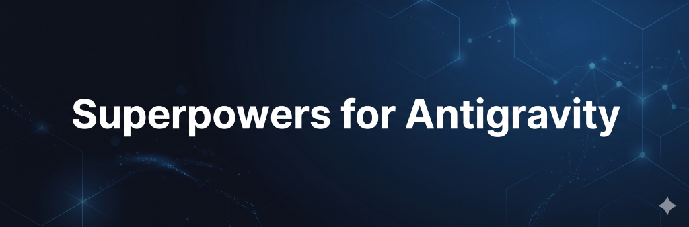

<p align="center">
  
</p>

<p align="center">
  <strong>A complete software development methodology for your coding agent.</strong><br>
  Composable skills that trigger automatically — your agent just has Superpowers.
</p>

<p align="center">
  <a href="#-installation"></a>
  <a href="RELEASE-NOTES.md"></a>
  <a href="https://github.com/obra/superpowers"></a>
  <a href="LICENSE"></a>
</p>

---

> **This is a fork of [obra/superpowers](https://github.com/obra/superpowers) rebuilt natively for [Google Antigravity 2.0](https://antigravity.google).** If you need multi-platform support (Claude Code, Codex, Cursor, etc.), use the upstream repo instead.

---

## ✨ How It Works

It starts from the moment you fire up your coding agent. As soon as it sees that you're building something, it *doesn't* just jump into trying to write code. Instead, it steps back and asks you what you're really trying to do.

Once it's teased a spec out of the conversation, it shows it to you in chunks short enough to actually read and digest.

After you've signed off on the design, your agent puts together an implementation plan that's clear enough for an enthusiastic junior engineer with poor taste, no judgement, no project context, and an aversion to testing to follow. It emphasises true red/green TDD, YAGNI (You Aren't Gonna Need It), and DRY.

Next up, once you say "go", it launches a *subagent-driven-development* process, having agents work through each engineering task, inspecting and reviewing their work, and continuing forward. It's not uncommon for agents to work autonomously for a couple hours at a time without deviating from the plan you put together.

There's a bunch more to it, but that's the core of the system. And because the skills trigger automatically, you don't need to do anything special. Your coding agent just has Superpowers.

## 🔀 What's Different from Upstream?

The original superpowers supports 9+ platforms via a tool mapping abstraction layer — skills are written with Claude Code tool names, and per-platform reference files translate at runtime.

This fork **removes the abstraction entirely**. All skills use native Antigravity 2.0 tool names directly (`view_file`, `run_command`, `invoke_subagent`, `define_subagent`, etc.), eliminating translation overhead and making every skill read exactly as the agent will execute it.

<details>
<summary><strong>Why remove cross-platform support?</strong> (click to expand)</summary>

The abstraction layer costs tokens on every interaction, and those costs compound across a session:

1. **Tool mapping file loaded every session.** The upstream approach loads a ~500-token tool mapping reference into context at session start. Every turn carries this translation table. This fork eliminates it entirely.

2. **Agent reasoning overhead.** When a skill says "use the Bash tool," the agent must look up the mapping, reason about which native tool to call, and potentially make mistakes. When skills say `run_command` directly, there's zero translation cost.

3. **Platform-conditional branching in skills.** The upstream `using-superpowers` skill has separate instruction blocks for Claude Code, Copilot CLI, Gemini CLI, Codex, Antigravity 2.0, and "other environments." Only one applies.

4. **86 fewer files in the project.** When agents explore the repo, fewer files means less noise in `list_dir` output and faster orientation.

5. **Smaller, focused skills.** Skills like `using-git-worktrees` went from ~216 lines to ~55 lines. Shorter skills = less context consumed.

</details>

### Comparison Table

| Area | Upstream (obra/superpowers) | This fork |
|------|---------------------------|-----------| 
| **Platforms** | 9+ (Claude Code, Codex, Cursor, etc.) | Antigravity 2.0 only |
| **Tool names in skills** | Claude Code names + mapping files | Native Antigravity names |
| **Subagent dispatch** | `Task tool (general-purpose)` | `invoke_subagent` / `define_subagent` |
| **Workspace isolation** | `git worktree` with fallback | Native `Workspace: "branch"` / `"share"` / `"inherit"` |
| **Task tracking** | `TodoWrite` tool | `task.md` artifacts with `RequestFeedback` |
| **Visual brainstorming** | Browser-based server | Native `generate_image` (no server needed) |
| **Plan formatting** | Plain markdown | Mermaid diagrams, file links, diff blocks, GitHub alerts |
| **Background tasks** | Not documented | `manage_task`, `send_message`, `schedule` (incl. cron) |
| **UI verification** | Not available | `browser-testing` skill with screenshot evidence |
| **Read-only subagents** | Full tool set for all | `TypeName: "research"` for reviewers |
| **Web research** | Not guided | `search_web` + `read_url_content` integrated |

### Core Enhancements

Beyond the platform port, this fork adds capabilities that don't exist upstream:

- 🎨 **`generate_image` in brainstorming** — native mockup generation with carousel comparisons
- 📐 **Rich plan formatting** — Mermaid architecture diagrams, clickable `file:///` links, diff blocks
- 🔄 **Async subagent coordination** — `manage_task` for builds, `send_message` mid-flight, `schedule` for timeouts
- 🌐 **Browser-testing skill** — evidence-before-assertions discipline for UI work
- 💰 **Token-saving subagents** — reviewers use `TypeName: "research"` (read-only, smaller context)
- ✅ **Automatic feedback loops** — `RequestFeedback: true` on design docs and plans
- 🔀 **Workspace mode guidance** — decision tables for `branch` / `inherit` / `share` per role
- 🔍 **Web research integration** — `search_web` woven into debugging, brainstorming, and planning

## 🚀 The Workflow

```
 ┌─────────────┐     ┌──────────────┐     ┌───────────────┐     ┌──────────────────────────┐
 │ Brainstorm  │ ──▶ │ Write Plan   │ ──▶ │ Create Branch │ ──▶ │ Subagent-Driven Dev      │
 │             │     │              │     │               │     │  ┌────────┐ ┌──────────┐ │
 │ • Questions │     │ • Tasks      │     │ • Isolated    │     │  │Implement│▶│  Review  │ │
 │ • Mockups   │     │ • Diagrams   │     │ • Clean base  │     │  └────────┘ └──────────┘ │
 │ • Design    │     │ • Specs      │     │ • Tests pass  │     │       ↺ per task         │
 └─────────────┘     └──────────────┘     └───────────────┘     └──────────────────────────┘
                                                                             │
                                                                             ▼
                                                                ┌──────────────────────────┐
                                                                │   Finish Branch          │
                                                                │  • Final review          │
                                                                │  • Merge / PR / Discard  │
                                                                └──────────────────────────┘
```

1. **brainstorming** — Refines rough ideas through questions, explores alternatives, generates visual mockups
2. **using-git-worktrees** — Creates isolated workspace via native `Workspace: "branch"`
3. **writing-plans** — Breaks work into bite-sized tasks with exact file paths and verification steps
4. **subagent-driven-development** - Fresh subagent per task with two-stage review (spec compliance + code quality)
5. **test-driven-development** — RED-GREEN-REFACTOR: write failing test → minimal code → pass → commit
6. **requesting-code-review** — Reviews against plan, reports issues by severity
7. **finishing-a-development-branch** — Verifies tests, presents merge/PR/keep/discard options

**Skills trigger automatically.** Mandatory workflows, not suggestions.

## 📦 Installation

### macOS / Linux

**Global plugin** (available in all projects):
```bash
git clone https://github.com/roundpilot/superpowers-antigravity ~/.gemini/config/plugins/superpowers
```

**Workspace plugin** (project-level only):
```bash
git clone https://github.com/roundpilot/superpowers-antigravity .agents/plugins/superpowers
```

**Update later:**
```bash
cd ~/.gemini/config/plugins/superpowers && git pull
```

### Windows (PowerShell)

**Global plugin** (available in all projects):
```powershell
git clone https://github.com/roundpilot/superpowers-antigravity "$env:USERPROFILE\.gemini\config\plugins\superpowers"
```

**Workspace plugin** (project-level only):
```powershell
git clone https://github.com/roundpilot/superpowers-antigravity .agents\plugins\superpowers
```

**Update later:**
```powershell
cd "$env:USERPROFILE\.gemini\config\plugins\superpowers"; git pull
```

### Windows (WSL)

If you run Antigravity inside WSL, use the Linux paths above.

If you run the **Windows Antigravity IDE** but your workspace is in **WSL**:

```bash
# Global plugin (installed on Windows side):
git clone https://github.com/roundpilot/superpowers-antigravity /mnt/c/Users/$USER/.gemini/config/plugins/superpowers

# Workspace plugin (inside your WSL workspace):
git clone https://github.com/roundpilot/superpowers-antigravity /path/to/your/wsl/project/.agents/plugins/superpowers
```

### Manual Installation (no git required)

<details>
<summary>Download ZIP instead of cloning (click to expand)</summary>

**macOS / Linux:**
```bash
curl -L https://github.com/roundpilot/superpowers-antigravity/archive/refs/heads/main.zip -o superpowers.zip
unzip superpowers.zip
mkdir -p ~/.gemini/config/plugins
mv superpowers-antigravity-main ~/.gemini/config/plugins/superpowers
rm superpowers.zip
```

**Windows (PowerShell):**
```powershell
Invoke-WebRequest -Uri "https://github.com/roundpilot/superpowers-antigravity/archive/refs/heads/main.zip" -OutFile superpowers.zip
Expand-Archive superpowers.zip -DestinationPath .
New-Item -ItemType Directory -Force -Path "$env:USERPROFILE\.gemini\config\plugins"
Move-Item superpowers-antigravity-main "$env:USERPROFILE\.gemini\config\plugins\superpowers"
Remove-Item superpowers.zip
```

To update later, delete the `superpowers` folder and repeat the steps above.

</details>

### Migrating from `roundpilot/superpowers`

If you previously installed from `roundpilot/superpowers`, update your remote:

```bash
cd ~/.gemini/config/plugins/superpowers
git remote set-url origin https://github.com/roundpilot/superpowers-antigravity.git
git pull
```

### ✅ Verify Installation

1. Start a new Antigravity session
2. Type `/using-superpowers` (or `/superpowers:using-superpowers` for the CLI)
3. Say "Let's make a react todo list"
4. The brainstorming skill should trigger automatically

## 📚 Skills Reference

### Testing & Verification
| Skill | Purpose |
|-------|---------|
| **test-driven-development** | RED-GREEN-REFACTOR cycle with testing anti-patterns reference |
| **browser-testing** | Evidence-before-assertions for UI work (screenshot → DOM inspect → embed proof) |

### Debugging
| Skill | Purpose |
|-------|---------|
| **systematic-debugging** | 4-phase root cause process with `search_web` for unfamiliar errors |
| **verification-before-completion** | Ensure it's actually fixed; cron schedules for long test suites |

### Collaboration
| Skill | Purpose |
|-------|---------|
| **brainstorming** | Socratic design refinement with `generate_image` mockups and `search_web` for prior art |
| **writing-plans** | Detailed plans with Mermaid diagrams, rich formatting, `RequestFeedback` |
| **executing-plans** | Inline plan execution with walkthrough generation |
| **dispatching-parallel-agents** | Concurrent workflows with `Workspace: "share"` and monitoring |
| **requesting-code-review** | `TypeName: "research"` reviewers with severity classification |
| **receiving-code-review** | Responding to feedback with technical rigor |
| **using-git-worktrees** | Workspace isolation with mode decision table |
| **finishing-a-development-branch** | Merge/PR decision workflow |
| **subagent-driven-development** | Fast iteration with two-stage task review and async coordination |

### Meta
| Skill | Purpose |
|-------|---------|
| **writing-skills** | Create new skills following best practices |
| **using-superpowers** | Introduction to the skills system |

## 🧭 Philosophy

- **Test-Driven Development** — Write tests first, always
- **Systematic over ad-hoc** — Process over guessing
- **Complexity reduction** — Simplicity as primary goal
- **Evidence over claims** — Verify before declaring success

## 🤝 Contributing

See [CONTRIBUTING.md](CONTRIBUTING.md) for contribution guidelines, PR requirements, and quality standards.

## 📜 License

MIT License — see [LICENSE](LICENSE) for details.

## 🙏 Acknowledgements

This project is a fork of [obra/superpowers](https://github.com/obra/superpowers). If Superpowers has helped you, consider [sponsoring the original project](https://github.com/sponsors/obra).
