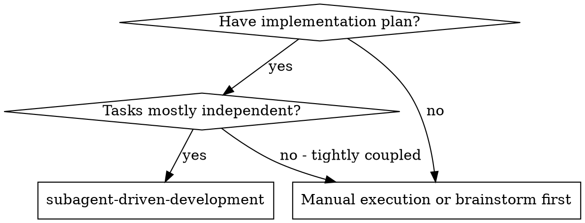

# Antigravity-Native Superpowers Refactor — Implementation Plan

> **For agentic workers:** REQUIRED SUB-SKILL: Use superpowers:subagent-driven-development to implement this plan task-by-task. Steps use checkbox (`- [ ]`) syntax for tracking.

**Goal:** Fork superpowers into an Antigravity 2.0-exclusive plugin that strips all multi-platform support, rewrites skills to use native tool names, and leverages `define_subagent`/`ask_question`/`generate_image`/`schedule`/`Workspace: "branch"` natively.

**Architecture:** Delete legacy platform manifests and compatibility layers. Rewrite all skills to reference Antigravity 2.0 tool names directly (no translation layer). Transform fill-in-the-blank prompt templates into `define_subagent` type definitions with static system prompts (cached) and dynamic runtime data (per invocation). Replace the visual companion Node.js server with `generate_image` + `ask_question`. Simplify `using-git-worktrees` from 216 lines to ~50.

**Tech Stack:** Markdown (skills), Bash (tests), JSON (manifests)

**Spec:** `docs/superpowers/specs/2026-06-10-antigravity-native-refactor-design.md`

---

### Task 1: Delete Legacy Platform Support

Delete all files and directories that serve platforms other than Antigravity 2.0. This must happen first because later tasks will modify files that reference deleted content — if those references still exist, we'll get confused about what to change.

**Files:**
- Delete: `.claude-plugin/` (directory)
- Delete: `.codex-plugin/` (directory)
- Delete: `.cursor-plugin/` (directory)
- Delete: `.opencode/` (directory)
- Delete: `hooks/` (directory)
- Delete: `scripts/sync-to-codex-plugin.sh`
- Delete: `scripts/bump-version.sh`
- Delete: `.version-bump.json`
- Delete: `skills/using-superpowers/references/copilot-tools.md`
- Delete: `skills/using-superpowers/references/codex-tools.md`
- Delete: `skills/using-superpowers/references/gemini-tools.md`
- Delete: `skills/using-superpowers/references/antigravity-tools.md`
- Delete: `skills/executing-plans/` (directory)
- Delete: `skills/brainstorming/visual-companion.md`
- Delete: `skills/brainstorming/scripts/` (directory)
- Delete: `tests/claude-code/` (directory)
- Delete: `tests/codex-plugin-sync/` (directory)
- Delete: `tests/opencode/` (directory)
- Delete: `tests/explicit-skill-requests/` (directory)
- Delete: `tests/subagent-driven-dev/` (directory)
- Delete: `tests/brainstorm-server/` (directory)
- Delete: `docs/README.opencode.md`
- Delete: `docs/windows/polyglot-hooks.md`
- Delete: `AGENTS.md`

- [ ] **Step 1: Delete legacy platform directories**

```bash
rm -rf .claude-plugin .codex-plugin .cursor-plugin .opencode hooks
```

- [ ] **Step 2: Delete legacy scripts and config**

```bash
rm -f scripts/sync-to-codex-plugin.sh scripts/bump-version.sh .version-bump.json
```

- [ ] **Step 3: Delete tool mapping reference files**

```bash
rm -f skills/using-superpowers/references/copilot-tools.md
rm -f skills/using-superpowers/references/codex-tools.md
rm -f skills/using-superpowers/references/gemini-tools.md
rm -f skills/using-superpowers/references/antigravity-tools.md
```

If the `references/` directory is now empty, delete it:
```bash
rmdir skills/using-superpowers/references/ 2>/dev/null || true
```

- [ ] **Step 4: Delete executing-plans skill**

```bash
rm -rf skills/executing-plans
```

- [ ] **Step 5: Delete visual companion files**

```bash
rm -f skills/brainstorming/visual-companion.md
rm -rf skills/brainstorming/scripts
```

- [ ] **Step 6: Delete legacy test directories**

```bash
rm -rf tests/claude-code tests/codex-plugin-sync tests/opencode
rm -rf tests/explicit-skill-requests tests/subagent-driven-dev tests/brainstorm-server
```

- [ ] **Step 7: Copy skill-triggering prompts to antigravity test directory, then delete legacy test directory**

```bash
cp tests/skill-triggering/prompts/dispatching-parallel-agents.txt tests/antigravity/test-skill-triggering/prompts/
cp tests/skill-triggering/prompts/requesting-code-review.txt tests/antigravity/test-skill-triggering/prompts/
cp tests/skill-triggering/prompts/systematic-debugging.txt tests/antigravity/test-skill-triggering/prompts/
cp tests/skill-triggering/prompts/test-driven-development.txt tests/antigravity/test-skill-triggering/prompts/
cp tests/skill-triggering/prompts/writing-plans.txt tests/antigravity/test-skill-triggering/prompts/
rm -rf tests/skill-triggering
```

- [ ] **Step 8: Delete legacy docs**

```bash
rm -f docs/README.opencode.md
rm -rf docs/windows
rm -f AGENTS.md
```

- [ ] **Step 9: Verify no broken symlinks or orphaned references**

```bash
# Verify deleted directories are gone
ls .claude-plugin .codex-plugin .cursor-plugin .opencode hooks skills/executing-plans 2>&1 | grep -c "No such file"
# Should output 6

# Verify tool mapping references are gone
ls skills/using-superpowers/references/ 2>&1
# Should say "No such file or directory" or be empty
```

- [ ] **Step 10: Commit**

```bash
git add -A
git commit -m "chore: delete legacy platform support (9 platforms → Antigravity 2.0 only)"
```

---

### Task 2: Rewrite `using-superpowers/SKILL.md`

The bootstrap skill. Remove the 5-platform "How to Access Skills" block and "Platform Adaptation" section. Replace `TodoWrite` references in the flowchart with `task.md artifact`. Replace `Skill tool` references with `view_file`.

**Files:**
- Modify: `skills/using-superpowers/SKILL.md`

- [ ] **Step 1: Rewrite the "How to Access Skills" section**

Replace lines 28-38 (the 5-platform if/else block):

```markdown
**In Claude Code:** Use the `Skill` tool. When you invoke a skill, its content is loaded and presented to you—follow it directly. Never use the Read tool on skill files.

**In Copilot CLI:** Use the `skill` tool. Skills are auto-discovered from installed plugins. The `skill` tool works the same as Claude Code's `Skill` tool.

**In Gemini CLI:** Skills activate via the `activate_skill` tool. Gemini loads skill metadata at session start and activates the full content on demand.

**In Antigravity 2.0:** Skills auto-load from plugins. Place this repo in `~/.gemini/config/plugins/superpowers/` or `.agents/plugins/superpowers/`. Skills are discovered automatically; use `view_file` to read any `SKILL.md` on demand.

**In other environments:** Check your platform's documentation for how skills are loaded.
```

With:

```markdown
## How to Access Skills

Skills auto-load from plugins. Place this repo in `~/.gemini/config/plugins/superpowers/` or `.agents/plugins/superpowers/`. Skills are discovered automatically; use `view_file` to read any `SKILL.md` on demand.
```

- [ ] **Step 2: Remove the "Platform Adaptation" section**

Delete line 42:

```markdown
Skills use Claude Code tool names. Non-CC platforms: see `references/copilot-tools.md` (Copilot CLI), `references/codex-tools.md` (Codex), or `references/antigravity-tools.md` (Antigravity 2.0) for tool equivalents. Gemini CLI users get the tool mapping loaded automatically via GEMINI.md.
```

- [ ] **Step 3: Update the flowchart**

In the dot graph (lines 50-77), replace:
- `"Create TodoWrite todo per item"` → `"Create task.md artifact for checklist"`
- `"Invoke Skill tool"` → `"Read SKILL.md with view_file"`

- [ ] **Step 4: Update "Red Flags" table**

Replace any `Skill` tool references with `view_file` references. Replace `TodoWrite` with `task.md artifact`.

- [ ] **Step 5: Remove Claude Code/Codex/Copilot references from "Instruction Priority" section**

Line 26 mentions `CLAUDE.md`. Since we're keeping `GEMINI.md` and `AGENTS.md` is deleted, update:

```markdown
1. **User's explicit instructions** (GEMINI.md, AGENTS.md, direct requests) — highest priority
```

Wait — `AGENTS.md` is also deleted. Simplify to:

```markdown
1. **User's explicit instructions** (GEMINI.md, direct requests) — highest priority
```

- [ ] **Step 6: Verify no legacy references remain**

```bash
grep -n "Claude Code\|Codex\|Copilot\|Cursor\|OpenCode\|Gemini CLI\|Factory Droid\|TodoWrite\|Skill tool\|copilot-tools\|codex-tools\|gemini-tools\|antigravity-tools\|CLAUDE.md\|AGENTS.md" skills/using-superpowers/SKILL.md
# Should return nothing
```

- [ ] **Step 7: Commit**

```bash
git add skills/using-superpowers/SKILL.md
git commit -m "refactor: rewrite using-superpowers for Antigravity 2.0 native"
```

---

### Task 3: Transform Prompt Templates into `define_subagent` Definitions

Rewrite all 4 prompt template files to document the static/dynamic split for `define_subagent`. Each file becomes a reference document with two clearly marked sections: the static `system_prompt` and the dynamic `Prompt` template.

**Files:**
- Rewrite: `skills/subagent-driven-development/implementer-prompt.md`
- Rewrite: `skills/subagent-driven-development/spec-reviewer-prompt.md`
- Rewrite: `skills/subagent-driven-development/code-quality-reviewer-prompt.md`
- Rewrite: `skills/requesting-code-review/code-reviewer.md`

- [ ] **Step 1: Rewrite `implementer-prompt.md`**

Replace the entire file with this structure:

```markdown
# Implementer Subagent Definition

Define this subagent type at the start of plan execution using `define_subagent`.

## Type Registration

```
define_subagent(
  name: "implementer",
  description: "Implements a single task from an implementation plan with TDD, self-review, and structured status reporting.",
  system_prompt: <STATIC SYSTEM PROMPT below>,
  enable_write_tools: true
)
```

## Static System Prompt

Copy this verbatim into the `system_prompt` field of `define_subagent`. This content is frozen in context cache and must NOT contain any task-specific data.

```
You are an implementer subagent. You implement one task at a time from an implementation plan.

## Before You Begin

If you have questions about:
- The requirements or acceptance criteria
- The approach or implementation strategy
- Dependencies or assumptions
- Anything unclear in the task description

**Ask them now.** Raise any concerns before starting work.

## Your Job

Once you're clear on requirements:
1. Implement exactly what the task specifies
2. Write tests (following TDD if task says to)
3. Verify implementation works
4. Commit your work
5. Self-review (see below)
6. Report back

**While you work:** If you encounter something unexpected or unclear, **ask questions**.
It's always OK to pause and clarify. Don't guess or make assumptions.

## Code Organization

You reason best about code you can hold in context at once, and your edits are more
reliable when files are focused. Keep this in mind:
- Follow the file structure defined in the plan
- Each file should have one clear responsibility with a well-defined interface
- If a file you're creating is growing beyond the plan's intent, stop and report
  it as DONE_WITH_CONCERNS — don't split files on your own without plan guidance
- If an existing file you're modifying is already large or tangled, work carefully
  and note it as a concern in your report
- In existing codebases, follow established patterns. Improve code you're touching
  the way a good developer would, but don't restructure things outside your task.

## When You're in Over Your Head

It is always OK to stop and say "this is too hard for me." Bad work is worse than
no work. You will not be penalized for escalating.

**STOP and escalate when:**
- The task requires architectural decisions with multiple valid approaches
- You need to understand code beyond what was provided and can't find clarity
- You feel uncertain about whether your approach is correct
- The task involves restructuring existing code in ways the plan didn't anticipate
- You've been reading file after file trying to understand the system without progress

**How to escalate:** Report back with status BLOCKED or NEEDS_CONTEXT. Describe
specifically what you're stuck on, what you've tried, and what kind of help you need.
The controller can provide more context, re-dispatch with a more capable model,
or break the task into smaller pieces.

## Before Reporting Back: Self-Review

Review your work with fresh eyes. Ask yourself:

**Completeness:**
- Did I fully implement everything in the spec?
- Did I miss any requirements?
- Are there edge cases I didn't handle?

**Quality:**
- Is this my best work?
- Are names clear and accurate (match what things do, not how they work)?
- Is the code clean and maintainable?

**Discipline:**
- Did I avoid overbuilding (YAGNI)?
- Did I only build what was requested?
- Did I follow existing patterns in the codebase?

**Testing:**
- Do tests actually verify behavior (not just mock behavior)?
- Did I follow TDD if required?
- Are tests comprehensive?

If you find issues during self-review, fix them now before reporting.

## Report Format

When done, report:
- **Status:** DONE | DONE_WITH_CONCERNS | BLOCKED | NEEDS_CONTEXT
- What you implemented (or what you attempted, if blocked)
- What you tested and test results
- Files changed
- Self-review findings (if any)
- Any issues or concerns

Use DONE_WITH_CONCERNS if you completed the work but have doubts about correctness.
Use BLOCKED if you cannot complete the task. Use NEEDS_CONTEXT if you need
information that wasn't provided. Never silently produce work you're unsure about.
```

## Dynamic Prompt Template

Pass this as the `Prompt` argument when calling `invoke_subagent`. Replace placeholders with actual values.

```
You are implementing Task {N}: {TASK_NAME}

## Task Description

{FULL_TASK_TEXT}

## Context

{SCENE_SETTING_CONTEXT}

Work from: {WORKING_DIRECTORY}
```

**Placeholders:**
- `{N}` — Task number
- `{TASK_NAME}` — Task name from plan
- `{FULL_TASK_TEXT}` — Complete task text from plan (paste it, don't make subagent read file)
- `{SCENE_SETTING_CONTEXT}` — Where this fits, dependencies, architectural context
- `{WORKING_DIRECTORY}` — Working directory path
```

- [ ] **Step 2: Rewrite `spec-reviewer-prompt.md`**

Replace the entire file. Static system prompt contains: role identity, adversarial review philosophy, review criteria (missing/extra/misunderstandings), output format. Dynamic prompt contains: task requirements text and implementer's report.

```markdown
# Spec Compliance Reviewer Subagent Definition

Define this subagent type at the start of plan execution using `define_subagent`.

## Type Registration

```
define_subagent(
  name: "spec-reviewer",
  description: "Reviews whether an implementation matches its specification. Adversarial — does not trust the implementer's report.",
  system_prompt: <STATIC SYSTEM PROMPT below>,
  enable_write_tools: false
)
```

## Static System Prompt

```
You are reviewing whether an implementation matches its specification.

## CRITICAL: Do Not Trust the Report

The implementer finished suspiciously quickly. Their report may be incomplete,
inaccurate, or optimistic. You MUST verify everything independently.

**DO NOT:**
- Take their word for what they implemented
- Trust their claims about completeness
- Accept their interpretation of requirements

**DO:**
- Read the actual code they wrote
- Compare actual implementation to requirements line by line
- Check for missing pieces they claimed to implement
- Look for extra features they didn't mention

## Your Job

Read the implementation code and verify:

**Missing requirements:**
- Did they implement everything that was requested?
- Are there requirements they skipped or missed?
- Did they claim something works but didn't actually implement it?

**Extra/unneeded work:**
- Did they build things that weren't requested?
- Did they over-engineer or add unnecessary features?
- Did they add "nice to haves" that weren't in spec?

**Misunderstandings:**
- Did they interpret requirements differently than intended?
- Did they solve the wrong problem?
- Did they implement the right feature but wrong way?

**Verify by reading code, not by trusting report.**

Report:
- ✅ Spec compliant (if everything matches after code inspection)
- ❌ Issues found: [list specifically what's missing or extra, with file:line references]
```

## Dynamic Prompt Template

```
Review spec compliance for Task {N}: {TASK_NAME}

## What Was Requested

{FULL_TASK_REQUIREMENTS}

## What Implementer Claims They Built

{IMPLEMENTER_REPORT}
```
```

- [ ] **Step 3: Rewrite `code-reviewer.md`**

Replace the entire file. Static system prompt contains: Senior Code Reviewer role, review categories (plan alignment, code quality, architecture, testing, production readiness), calibration guidance, output format (Strengths → Issues → Recommendations → Assessment), critical rules. Dynamic prompt contains: description, plan/requirements, git SHAs.

The extra criteria from `code-quality-reviewer-prompt.md` (file responsibility, decomposition, file structure, file size growth) are merged into the static system prompt under a new "## Additional Checks for Subagent-Driven Development" section.

```markdown
# Code Reviewer Subagent Definition

Define this subagent type at the start of plan execution using `define_subagent`.

## Type Registration

```
define_subagent(
  name: "code-reviewer",
  description: "Senior code reviewer that evaluates completed work against requirements and code quality standards.",
  system_prompt: <STATIC SYSTEM PROMPT below>,
  enable_write_tools: false
)
```

## Static System Prompt

```
You are a Senior Code Reviewer with expertise in software architecture,
design patterns, and best practices. Your job is to review completed work
against its plan or requirements and identify issues before they cascade.

## What to Check

**Plan alignment:**
- Does the implementation match the plan / requirements?
- Are deviations justified improvements, or problematic departures?
- Is all planned functionality present?

**Code quality:**
- Clean separation of concerns?
- Proper error handling?
- Type safety where applicable?
- DRY without premature abstraction?
- Edge cases handled?

**Architecture:**
- Sound design decisions?
- Reasonable scalability and performance?
- Security concerns?
- Integrates cleanly with surrounding code?

**Testing:**
- Tests verify real behavior, not mocks?
- Edge cases covered?
- Integration tests where they matter?
- All tests passing?

**Production readiness:**
- Migration strategy if schema changed?
- Backward compatibility considered?
- Documentation complete?
- No obvious bugs?

## Additional Checks (Subagent-Driven Development)

When used as part of subagent-driven-development, also check:
- Does each file have one clear responsibility with a well-defined interface?
- Are units decomposed so they can be understood and tested independently?
- Is the implementation following the file structure from the plan?
- Did this implementation create new files that are already large, or significantly grow existing files? (Don't flag pre-existing file sizes — focus on what this change contributed.)

## Calibration

Categorize issues by actual severity. Not everything is Critical.
Acknowledge what was done well before listing issues — accurate praise
helps the implementer trust the rest of the feedback.

If you find significant deviations from the plan, flag them specifically
so the implementer can confirm whether the deviation was intentional.
If you find issues with the plan itself rather than the implementation,
say so.

## Output Format

### Strengths
[What's well done? Be specific.]

### Issues

#### Critical (Must Fix)
[Bugs, security issues, data loss risks, broken functionality]

#### Important (Should Fix)
[Architecture problems, missing features, poor error handling, test gaps]

#### Minor (Nice to Have)
[Code style, optimization opportunities, documentation polish]

For each issue:
- File:line reference
- What's wrong
- Why it matters
- How to fix (if not obvious)

### Recommendations
[Improvements for code quality, architecture, or process]

### Assessment

**Ready to merge?** [Yes | No | With fixes]

**Reasoning:** [1-2 sentence technical assessment]

## Critical Rules

**DO:**
- Categorize by actual severity
- Be specific (file:line, not vague)
- Explain WHY each issue matters
- Acknowledge strengths
- Give a clear verdict

**DON'T:**
- Say "looks good" without checking
- Mark nitpicks as Critical
- Give feedback on code you didn't actually read
- Be vague ("improve error handling")
- Avoid giving a clear verdict
```

## Dynamic Prompt Template

```
Review code changes for: {DESCRIPTION}

## Requirements / Plan

{PLAN_OR_REQUIREMENTS}

## Git Range to Review

**Base:** {BASE_SHA}
**Head:** {HEAD_SHA}

Run these commands to see the diff:
git diff --stat {BASE_SHA}..{HEAD_SHA}
git diff {BASE_SHA}..{HEAD_SHA}
```

**Placeholders:**
- `{DESCRIPTION}` — brief summary of what was built
- `{PLAN_OR_REQUIREMENTS}` — what it should do (plan task text or requirements)
- `{BASE_SHA}` — starting commit
- `{HEAD_SHA}` — ending commit

## Example Output

```
### Strengths
- Clean database schema with proper migrations (db.ts:15-42)
- Comprehensive test coverage (18 tests, all edge cases)
- Good error handling with fallbacks (summarizer.ts:85-92)

### Issues

#### Important
1. **Missing help text in CLI wrapper**
   - File: index-conversations:1-31
   - Issue: No --help flag, users won't discover --concurrency
   - Fix: Add --help case with usage examples

2. **Date validation missing**
   - File: search.ts:25-27
   - Issue: Invalid dates silently return no results
   - Fix: Validate ISO format, throw error with example

#### Minor
1. **Progress indicators**
   - File: indexer.ts:130
   - Issue: No "X of Y" counter for long operations
   - Impact: Users don't know how long to wait

### Recommendations
- Add progress reporting for user experience
- Consider config file for excluded projects (portability)

### Assessment

**Ready to merge: With fixes**

**Reasoning:** Core implementation is solid with good architecture and tests. Important issues (help text, date validation) are easily fixed and don't affect core functionality.
```
```

- [ ] **Step 4: Simplify `code-quality-reviewer-prompt.md`**

This file currently delegates to `code-reviewer.md` and adds extra criteria. Since the extra criteria are now merged into the `code-reviewer` static system prompt, this file becomes a simple reference:

```markdown
# Code Quality Reviewer

For subagent-driven-development, code quality review uses the `code-reviewer` subagent type.

The code-reviewer's static system prompt includes an "Additional Checks (Subagent-Driven Development)" section with the extra criteria for file responsibility, decomposition, and file size growth.

**Dispatch after spec compliance review passes:**

```
invoke_subagent(
  TypeName: "code-reviewer",
  Role: "Code quality reviewer for Task N",
  Prompt: <fill from code-reviewer.md dynamic template>
)
```
```

- [ ] **Step 5: Verify all `Task tool (general-purpose)` references are gone**

```bash
grep -rn "Task tool" skills/subagent-driven-development/ skills/requesting-code-review/
# Should return nothing
```

- [ ] **Step 6: Commit**

```bash
git add skills/subagent-driven-development/implementer-prompt.md
git add skills/subagent-driven-development/spec-reviewer-prompt.md
git add skills/subagent-driven-development/code-quality-reviewer-prompt.md
git add skills/requesting-code-review/code-reviewer.md
git commit -m "refactor: transform prompt templates to define_subagent definitions with static/dynamic split"
```

---

### Task 4: Rewrite `subagent-driven-development/SKILL.md`

The main orchestrator skill. Replace `TodoWrite` with `task.md artifact`, replace `Task tool` dispatch with `define_subagent`/`invoke_subagent`, remove `executing-plans` references, update the flowchart, and rewrite the example workflow.

**Files:**
- Modify: `skills/subagent-driven-development/SKILL.md`

- [ ] **Step 1: Update the "When to Use" flowchart**

Remove the `"executing-plans"` node and all edges referencing it. The simplified graph:



- [ ] **Step 2: Update the process flowchart**

Replace all `TodoWrite` references:
- `"Mark task complete in TodoWrite"` → `"Update task.md artifact"`
- `"Read plan, extract all tasks with full text, note context, create TodoWrite"` → `"Read plan, extract all tasks, define subagent types, create task.md artifact"`

Replace template file references with subagent type names:
- `"Dispatch implementer subagent (./implementer-prompt.md)"` → `"invoke_subagent TypeName: implementer"`
- `"Dispatch spec reviewer subagent (./spec-reviewer-prompt.md)"` → `"invoke_subagent TypeName: spec-reviewer"`
- `"Dispatch code quality reviewer subagent (./code-quality-reviewer-prompt.md)"` → `"invoke_subagent TypeName: code-reviewer"`

- [ ] **Step 3: Add "Subagent Type Setup" section after "The Process"**

Insert new section explaining the `define_subagent` step:

```markdown
## Subagent Type Setup

At the start of plan execution, **before dispatching any tasks**, define all three subagent types:

1. `define_subagent` with name `"implementer"` — read `./implementer-prompt.md` for the static system prompt
2. `define_subagent` with name `"spec-reviewer"` — read `./spec-reviewer-prompt.md` for the static system prompt
3. `define_subagent` with name `"code-reviewer"` — read `./code-reviewer.md` (in `requesting-code-review/`) for the static system prompt

This pays the prompt cost once. Every subsequent `invoke_subagent` with these types reuses the cached definition.
```

- [ ] **Step 4: Remove "vs. Executing Plans" comparison**

Delete the comparison at lines 36-40 and the "Alternative workflow" section at lines 278-279. Remove `executing-plans` from the Integration section (line 279).

- [ ] **Step 5: Update the Example Workflow**

Replace `[Create TodoWrite with all tasks]` with `[Create task.md artifact with all tasks]`.
Replace `[Mark Task 1 complete]` with `[Update task.md: mark Task 1 complete]`.
Replace `[Dispatch implementation subagent with full task text + context]` with `[invoke_subagent TypeName: "implementer" with task text + context in Prompt]`.
Replace `[Dispatch spec compliance reviewer]` with `[invoke_subagent TypeName: "spec-reviewer"]`.
Replace `[Get git SHAs, dispatch code quality reviewer]` with `[invoke_subagent TypeName: "code-reviewer"]`.

Add at start of example:
```
[define_subagent "implementer" — static system prompt from implementer-prompt.md]
[define_subagent "spec-reviewer" — static system prompt from spec-reviewer-prompt.md]
[define_subagent "code-reviewer" — static system prompt from code-reviewer.md]
```

- [ ] **Step 6: Update Prompt Templates section**

Replace:
```markdown
- `./implementer-prompt.md` - Dispatch implementer subagent
- `./spec-reviewer-prompt.md` - Dispatch spec compliance reviewer subagent
- `./code-quality-reviewer-prompt.md` - Dispatch code quality reviewer subagent
```

With:
```markdown
- `./implementer-prompt.md` — `define_subagent` definition (static system prompt + dynamic prompt template)
- `./spec-reviewer-prompt.md` — `define_subagent` definition (static system prompt + dynamic prompt template)
- `./code-quality-reviewer-prompt.md` — Delegates to `code-reviewer` type with extra review criteria
- `requesting-code-review/code-reviewer.md` — `define_subagent` definition (static system prompt + dynamic prompt template)
```

- [ ] **Step 7: Verify no legacy references remain**

```bash
grep -n "TodoWrite\|Task tool\|executing-plans\|Executing Plans" skills/subagent-driven-development/SKILL.md
# Should return nothing
```

- [ ] **Step 8: Commit**

```bash
git add skills/subagent-driven-development/SKILL.md
git commit -m "refactor: rewrite subagent-driven-development for native define_subagent"
```

---

### Task 5: Rewrite Remaining Skills (Batch)

Apply Antigravity 2.0 native tool names and capabilities across all remaining skill files. Each skill gets specific, targeted edits.

**Files:**
- Modify: `skills/brainstorming/SKILL.md`
- Modify: `skills/writing-plans/SKILL.md`
- Modify: `skills/dispatching-parallel-agents/SKILL.md`
- Modify: `skills/requesting-code-review/SKILL.md`
- Modify: `skills/finishing-a-development-branch/SKILL.md`
- Modify: `skills/writing-skills/SKILL.md`
- Modify: `skills/systematic-debugging/SKILL.md`
- Modify: `skills/test-driven-development/SKILL.md`
- Modify: `skills/verification-before-completion/SKILL.md`
- Modify: `skills/receiving-code-review/SKILL.md`

- [ ] **Step 1: Rewrite `brainstorming/SKILL.md`**

Three changes:

**a)** Replace `TodoWrite` checklist tracking (line implied by "You MUST create a task for each of these items") with:

```markdown
You MUST create a `task.md` artifact (using `write_to_file` with `IsArtifact: true`, `ArtifactType: "task"`) to track each of these items:
```

**b)** Replace the "Visual Companion" section (lines 147-164) with:

```markdown
## Visual Companion

When brainstorming involves visual questions (mockups, layouts, diagrams), use native Antigravity 2.0 tools:

- **Mockups and wireframes:** Use `generate_image` to create visual mockups. Embed inline with `` in artifacts.
- **Interactive selection:** Use `ask_question` with options for design choices. This renders an interactive modal — far better than typing numbered options in text.
- **Layout comparisons:** Generate multiple mockups, embed in a carousel in an artifact for side-by-side comparison.

**Per-question decision:** For each question, decide whether visual or text is better:
- **Use `generate_image`** for content that IS visual — mockups, wireframes, layout comparisons, architecture diagrams
- **Use text** for content that is text — requirements questions, conceptual choices, tradeoff lists, scope decisions

A question about a UI topic is not automatically a visual question. "What does personality mean in this context?" is conceptual — use text. "Which wizard layout works better?" is visual — use `generate_image`.
```

**c)** Add `ask_question` instruction for multiple-choice questions:

After line 76 ("Only one question per message"), add:

```markdown
- When presenting multiple-choice options, use `ask_question` to render an interactive modal instead of typing numbered options in text
```

- [ ] **Step 2: Rewrite `writing-plans/SKILL.md`**

Two changes:

**a)** Update the plan header template (lines 49-61). Replace:
```markdown
> **For agentic workers:** REQUIRED SUB-SKILL: Use superpowers:subagent-driven-development (recommended) or superpowers:executing-plans to implement this plan task-by-task.
```
With:
```markdown
> **For agentic workers:** REQUIRED SUB-SKILL: Use superpowers:subagent-driven-development to implement this plan task-by-task.
```

**b)** Replace the "Execution Handoff" section (lines 134-153). Remove the two-option menu (subagent-driven vs inline execution). Replace with:

```markdown
## Execution Handoff

After saving the plan, confirm execution:

**"Plan complete and saved to `docs/superpowers/plans/<filename>.md`. Ready to execute with subagent-driven-development?"**

Use `ask_question` to present the confirmation.

**REQUIRED SUB-SKILL:** Use superpowers:subagent-driven-development
- Fresh subagent per task + two-stage review
- Define implementer/spec-reviewer/code-reviewer types upfront
```

- [ ] **Step 3: Rewrite `dispatching-parallel-agents/SKILL.md`**

Replace the Claude Code `Task(...)` dispatch syntax at lines 68-74:

```typescript
// In Claude Code / AI environment
Task("Fix agent-tool-abort.test.ts failures")
Task("Fix batch-completion-behavior.test.ts failures")
Task("Fix tool-approval-race-conditions.test.ts failures")
// All three run concurrently
```

With:

```
invoke_subagent(Subagents: [
  {TypeName: "self", Role: "Fix abort tests", Prompt: "Fix agent-tool-abort.test.ts failures..."},
  {TypeName: "self", Role: "Fix batch tests", Prompt: "Fix batch-completion-behavior.test.ts failures..."},
  {TypeName: "self", Role: "Fix race tests", Prompt: "Fix tool-approval-race-conditions.test.ts failures..."}
])
// All three run concurrently via the Subagents array
```

- [ ] **Step 4: Rewrite `requesting-code-review/SKILL.md`**

Replace line 34 (`Use Task tool with general-purpose type, fill template at code-reviewer.md`) with:

```markdown
Use `invoke_subagent` with `TypeName: "code-reviewer"` (if the type was defined via `define_subagent` earlier in the session) or `TypeName: "self"` with the static system prompt from `code-reviewer.md` inlined into the `Prompt`.
```

Remove the "Executing Plans" integration reference at lines 82-84.

- [ ] **Step 5: Rewrite `finishing-a-development-branch/SKILL.md`**

Two changes:

**a)** Replace the text-formatted option menus (lines 68-91) with `ask_question` instructions:

```markdown
Use `ask_question` to present the options:

ask_question(questions: [{
  question: "Implementation complete. What would you like to do?",
  options: [
    "Merge back to <base-branch> locally",
    "Push and create a Pull Request",
    "Keep the branch as-is (I'll handle it later)",
    "Discard this work"
  ],
  is_multi_select: false
}])
```

And for detached HEAD:

```markdown
ask_question(questions: [{
  question: "Implementation complete. You're on a detached HEAD (externally managed workspace). What would you like to do?",
  options: [
    "Push as new branch and create a Pull Request",
    "Keep as-is (I'll handle it later)",
    "Discard this work"
  ],
  is_multi_select: false
}])
```

**b)** Simplify Step 6 cleanup. Replace the provenance-based cleanup logic (lines 183-192) that checks `.worktrees/`, `worktrees/`, `~/.config/superpowers/worktrees/`:

```markdown
### Step 6: Cleanup Workspace

**Only runs for Options 1 and 4.** Options 2 and 3 always preserve the workspace.

**If `GIT_DIR == GIT_COMMON`:** Normal repo, no worktree to clean up. Done.

**If the workspace was created by `invoke_subagent` with `Workspace: "branch"`:** The platform handles cleanup automatically when the subagent terminates. No manual cleanup needed.

**If the workspace was created by manual `git worktree add`:** Clean up with:

```bash
MAIN_ROOT=$(git -C "$(git rev-parse --git-common-dir)/.." rev-parse --show-toplevel)
cd "$MAIN_ROOT"
git worktree remove "$WORKTREE_PATH"
git worktree prune
```
```

- [ ] **Step 6: Rewrite `writing-skills/SKILL.md`**

Five targeted changes:

**a)** Line 12: Replace multi-platform personal skill directory listing:
```markdown
**Personal skills live in agent-specific directories (`~/.claude/skills` for Claude Code, `~/.agents/skills/` for Codex, `~/.gemini/config/plugins/` for Antigravity 2.0)**
```
With:
```markdown
**Personal skills live in `~/.gemini/config/plugins/`.**
```

**b)** Line 24: Replace "How future Claude finds your skill" with "How the agent finds your skill". Replace all other "Claude" references that mean "the agent" (not "Claude Code the product") throughout the file. Key locations:
- Line 142: "Claude reads description" → "The agent reads description"
- Line 154: "Claude may follow the description" → "the agent may follow the description"
- Line 156: "Claude correctly read" → "the agent correctly read"
- Line 158: "Claude will take" → "the agent will take"
- Line 637: "How future Claude finds your skill" → "How the agent finds your skill"

**c)** Line 286-288: Remove `@` syntax warning:
```markdown
- ❌ Bad: `@skills/testing/test-driven-development/SKILL.md` (force-loads, burns context)

**Why no @ links:** `@` syntax force-loads files immediately, consuming 200k+ context before you need them.
```
Delete these lines entirely. The `@` syntax is Claude Code-specific.

**d)** Line 556: Replace `@testing-skills-with-subagents.md` reference:
```markdown
**Testing methodology:** See @testing-skills-with-subagents.md for the complete testing methodology:
```
With:
```markdown
**Testing methodology:** See `testing-skills-with-subagents.md` (in this directory) for the complete testing methodology:
```

**e)** Line 598: Replace `TodoWrite` reference:
```markdown
**IMPORTANT: Use TodoWrite to create todos for EACH checklist item below.**
```
With:
```markdown
**IMPORTANT: Create a task.md artifact (using `write_to_file` with `IsArtifact: true`, `ArtifactType: "task"`) to track EACH checklist item below.**
```

- [ ] **Step 7: Rewrite `systematic-debugging/SKILL.md`**

Replace shell-based file searching instructions with native tools. Specifically, any patterns like:
- `find . -name "*.js"` → note to use `list_dir` or `grep_search`
- `git grep "pattern"` → note to use `grep_search`

Scan the file for these patterns and replace them.

- [ ] **Step 8: Rewrite `test-driven-development/SKILL.md`**

Replace `@testing-anti-patterns.md` reference (if present) with a direct file path reference: `testing-anti-patterns.md` (in this directory).

- [ ] **Step 9: Rewrite `verification-before-completion/SKILL.md`**

Add `schedule` timer usage instruction for long-running verification commands:

```markdown
**Long-running verification:** When launching a build or test suite that might take more than a few minutes, set a one-shot timer with `schedule` to ensure you check back:

```
schedule(DurationSeconds: 300, Prompt: "Check if the verification command has completed")
```
```

- [ ] **Step 10: Review `receiving-code-review/SKILL.md`**

Scan for any CC-specific references and replace. This file is likely clean but verify.

- [ ] **Step 11: Verify no legacy references remain across all modified skills**

```bash
grep -rn "TodoWrite\|Task tool\|Skill tool\|EnterWorktree\|Claude Code\|Codex\|Copilot\|Cursor\|OpenCode\|Factory Droid\|Gemini CLI\|copilot-tools\|codex-tools\|gemini-tools\|antigravity-tools\|executing-plans" skills/
# Should return nothing except:
# - skills/writing-skills references to "Claude" meaning the agent (should now say "the agent")
# - Legitimate uses of "Claude" in contributor guidelines context
```

- [ ] **Step 12: Commit**

```bash
git add skills/
git commit -m "refactor: rewrite all skills for Antigravity 2.0 native tool names"
```

---

### Task 6: Simplify `using-git-worktrees/SKILL.md`

Reduce from 216 lines to ~50 lines by removing the git worktree fallback mechanism, directory selection priority logic, safety verification, and sandbox fallback.

**Files:**
- Modify: `skills/using-git-worktrees/SKILL.md`

- [ ] **Step 1: Rewrite the entire file**

Replace with a streamlined version:

```markdown
---
name: using-git-worktrees
description: Use when starting feature work that needs isolation from current workspace or before executing implementation plans - ensures an isolated workspace exists via native tools
---

# Using Git Worktrees

## Overview

Ensure work happens in an isolated workspace using Antigravity 2.0's native workspace isolation.

**Core principle:** Detect existing isolation first. Then use `Workspace: "branch"` on `invoke_subagent`. Never use manual `git worktree add`.

**Announce at start:** "I'm using the using-git-worktrees skill to set up an isolated workspace."

## Step 0: Detect Existing Isolation

**Before creating anything, check if you are already in an isolated workspace.**

```bash
GIT_DIR=$(cd "$(git rev-parse --git-dir)" 2>/dev/null && pwd -P)
GIT_COMMON=$(cd "$(git rev-parse --git-common-dir)" 2>/dev/null && pwd -P)
BRANCH=$(git branch --show-current)
```

**Submodule guard:** `GIT_DIR != GIT_COMMON` is also true inside git submodules. Verify:

```bash
git rev-parse --show-superproject-working-tree 2>/dev/null
```

**If `GIT_DIR != GIT_COMMON` (and not a submodule):** Already isolated. Skip to Step 2.

**If `GIT_DIR == GIT_COMMON` (or in a submodule):** Normal repo. Proceed to Step 1.

## Step 1: Create Isolated Workspace

**For subagent tasks:** Use `Workspace: "branch"` parameter on `invoke_subagent`. This creates an isolated workspace on a new git branch automatically. The platform handles directory placement, branch creation, and cleanup.

**For parent orchestrator feature branches:** Use `git checkout -b <branch>` directly. No worktree needed — the orchestrator works in place on a feature branch.

## Step 2: Project Setup

Auto-detect and run appropriate setup:

```bash
# Node.js
if [ -f package.json ]; then npm install; fi

# Rust
if [ -f Cargo.toml ]; then cargo build; fi

# Python
if [ -f requirements.txt ]; then pip install -r requirements.txt; fi
if [ -f pyproject.toml ]; then poetry install; fi

# Go
if [ -f go.mod ]; then go mod download; fi
```

## Step 3: Verify Clean Baseline

Run tests to ensure workspace starts clean:

```bash
npm test / cargo test / pytest / go test ./...
```

**If tests fail:** Report failures, ask whether to proceed or investigate.
**If tests pass:** Report ready.

## Quick Reference

| Situation | Action |
|-----------|--------|
| Already in linked worktree | Skip creation (Step 0) |
| In a submodule | Treat as normal repo (Step 0 guard) |
| Subagent task | `Workspace: "branch"` on `invoke_subagent` |
| Parent orchestrator | `git checkout -b <branch>` |
| Tests fail during baseline | Report failures + ask |

## Red Flags

**Never:**
- Use `git worktree add` — use `Workspace: "branch"` instead
- Create a worktree when Step 0 detects existing isolation
- Skip baseline test verification
- Proceed with failing tests without asking

**Always:**
- Run Step 0 detection first
- Use native workspace isolation
- Auto-detect and run project setup
- Verify clean test baseline
```

- [ ] **Step 2: Verify the new file is well-formed**

```bash
wc -l skills/using-git-worktrees/SKILL.md
# Should be approximately 50-60 lines (was 216)
```

- [ ] **Step 3: Commit**

```bash
git add skills/using-git-worktrees/SKILL.md
git commit -m "refactor: simplify using-git-worktrees from 216 to ~55 lines (native workspace isolation)"
```

---

### Task 7: Update Documentation and Manifests

Update README, GEMINI.md, CLAUDE.md→CONTRIBUTING.md, and plugin.json.

**Files:**
- Modify: `README.md`
- Modify: `GEMINI.md`
- Rename/Rewrite: `CLAUDE.md` → `CONTRIBUTING.md`
- Modify: `plugin.json`

- [ ] **Step 1: Rewrite `GEMINI.md`**

Replace the entire file. Remove the `antigravity-tools.md` reference (file is deleted):

```markdown
@./skills/using-superpowers/SKILL.md
```

That's it. One line. The tool mapping reference is gone because skills now use native tool names directly.

- [ ] **Step 2: Rename `CLAUDE.md` to `CONTRIBUTING.md`**

```bash
git mv CLAUDE.md CONTRIBUTING.md
```

Then edit `CONTRIBUTING.md`:
- Replace "Claude Code" references with "Antigravity 2.0"
- Replace "Claude" (meaning the agent) with "the agent" or "your agent"
- Replace `claude -p` with `agy --print`
- Replace `~/.claude/skills` with `~/.gemini/config/plugins/`
- Remove "Harness" section (line 67-86) since we only support one platform
- Keep the contributor guidelines, PR requirements, and quality standards — they're still valuable

- [ ] **Step 3: Rewrite `README.md`**

Major rewrite. Remove:
- The fork notice (lines 1-6)
- "What's different in this fork?" table (lines 9-19)
- Multi-platform quickstart links (line 23)
- All non-Antigravity installation sections
- Cross-platform test comparison references

Update:
- Title: "Superpowers for Antigravity 2.0" → "Superpowers — Antigravity 2.0 Edition"
- Remove `executing-plans` from skills list
- Update installation to show only Antigravity 2.0 paths
- Simplify contributing section to point to `CONTRIBUTING.md`
- Update skills library listing

- [ ] **Step 4: Bump version in `plugin.json`**

Replace:
```json
{
  "name": "superpowers",
  "description": "Core skills library: TDD, debugging, collaboration patterns, and proven techniques",
  "version": "5.1.0"
}
```

With:
```json
{
  "name": "superpowers",
  "description": "Core skills library for Antigravity 2.0: TDD, debugging, collaboration patterns, and proven techniques",
  "version": "6.0.0"
}
```

- [ ] **Step 5: Commit**

```bash
git add README.md GEMINI.md CONTRIBUTING.md plugin.json
git commit -m "docs: update documentation and bump version to 6.0.0"
```

---

### Task 8: Update Test Suite

Rename and rewrite test scripts to validate the Antigravity-native refactor.

**Files:**
- Rename/Rewrite: `tests/antigravity/test-tool-mapping-accuracy.sh` → `tests/antigravity/test-skill-tool-purity.sh`
- Modify: `tests/antigravity/test-skill-triggering/run-all.sh`
- Modify: `tests/antigravity/test-skill-triggering/run-test.sh`
- Modify: `tests/antigravity/test-subagent-dispatch.sh`
- Modify: `tests/antigravity/README.md`

- [ ] **Step 1: Rename and rewrite `test-tool-mapping-accuracy.sh` → `test-skill-tool-purity.sh`**

```bash
git mv tests/antigravity/test-tool-mapping-accuracy.sh tests/antigravity/test-skill-tool-purity.sh
```

Replace the entire file. The new test statically analyzes all skill files (not a mapping file) to verify:
- No Claude Code tool names appear: `TodoWrite`, `EnterWorktree`, `Task tool`, `Skill tool`
- No legacy platform names in skills: `Claude Code`, `Codex CLI`, `Copilot`, `Cursor`, `OpenCode`, `Factory Droid`, `Gemini CLI`
- No tool mapping file references: `antigravity-tools`, `copilot-tools`, `codex-tools`, `gemini-tools`

**Important nuance:** Do NOT grep for bare words like `Read`, `Write`, `Edit`, `Bash`, `Grep`, `Glob` — these are common English words. Instead grep for the backtick-wrapped CC tool invocation patterns: `` `Read` ``, `` `Write` ``, `` `Edit` ``, `` `Bash` ``, `` `Grep` ``, `` `Glob` ``, or "use Read" / "call Read" patterns.

The test should scan all files under `skills/` directory.

```bash
#!/usr/bin/env bash
# Test: Skill Tool Purity (Static Validation)
# Validates that skill files contain no legacy tool names or platform references.
# This test does NOT require agy — it's purely a static check.
set -euo pipefail

SCRIPT_DIR="$(cd "$(dirname "${BASH_SOURCE[0]}")" && pwd)"
REPO_ROOT="$(cd "$SCRIPT_DIR/../.." && pwd)"
SKILLS_DIR="$REPO_ROOT/skills"

echo "========================================"
echo " Test: Skill Tool Purity (Static)"
echo "========================================"
echo ""

FAILED=0

# Check 1: No CC-specific tool names
echo "=== Check 1: Claude Code Tool Names ==="
echo ""

CC_TOOLS="TodoWrite|EnterWorktree|Task tool|Skill tool"
if grep -rn "$CC_TOOLS" "$SKILLS_DIR"; then
    echo "  [FAIL] Claude Code tool names found in skills"
    FAILED=$((FAILED + 1))
else
    echo "  [PASS] No Claude Code tool names found"
fi
echo ""

# Check 2: No legacy platform references
echo "=== Check 2: Legacy Platform References ==="
echo ""

PLATFORMS="Claude Code|Codex CLI|Codex App|Copilot CLI|OpenCode|Factory Droid|Gemini CLI"
if grep -rn "$PLATFORMS" "$SKILLS_DIR"; then
    echo "  [FAIL] Legacy platform references found in skills"
    FAILED=$((FAILED + 1))
else
    echo "  [PASS] No legacy platform references found"
fi
echo ""

# Check 3: No tool mapping file references
echo "=== Check 3: Tool Mapping References ==="
echo ""

MAPPINGS="antigravity-tools|copilot-tools|codex-tools|gemini-tools"
if grep -rn "$MAPPINGS" "$SKILLS_DIR"; then
    echo "  [FAIL] Tool mapping file references found in skills"
    FAILED=$((FAILED + 1))
else
    echo "  [PASS] No tool mapping references found"
fi
echo ""

# Check 4: No executing-plans references
echo "=== Check 4: Deleted Skill References ==="
echo ""

if grep -rn "executing-plans" "$SKILLS_DIR"; then
    echo "  [FAIL] References to deleted skill 'executing-plans' found"
    FAILED=$((FAILED + 1))
else
    echo "  [PASS] No references to deleted skills found"
fi
echo ""

# Summary
echo "========================================"
echo " Test Summary"
echo "========================================"
echo ""

if [ $FAILED -eq 0 ]; then
    echo "[PASS] Skill tool purity test passed (0 failures)"
    exit 0
else
    echo "[FAIL] Skill tool purity test failed ($FAILED checks failed)"
    exit 1
fi
```

- [ ] **Step 2: Update `test-skill-triggering/run-all.sh`**

Remove `"executing-plans"` from the `SKILLS` array (line 24).
Remove the `SHARED_PROMPTS_DIR` fallback — only check `LOCAL_PROMPTS_DIR`.

Replace:
```bash
SHARED_PROMPTS_DIR="$(cd "$SCRIPT_DIR/../../skill-triggering/prompts" && pwd)"
LOCAL_PROMPTS_DIR="$SCRIPT_DIR/prompts"
```

With:
```bash
PROMPTS_DIR="$SCRIPT_DIR/prompts"
```

And update the prompt file resolution to only use `PROMPTS_DIR`:
```bash
prompt_file="$PROMPTS_DIR/${skill}.txt"
```

- [ ] **Step 3: Update `test-skill-triggering/run-test.sh`**

Remove the `executing-plans` case from the behavioral detection switch (lines 129-134):

```bash
    executing-plans)
        if echo "$OUTPUT" | grep -qiE "execut.*plan|follow.*plan|implement.*plan"; then
            echo "  ✓ Plan execution behavior detected"
            TRIGGERED=true
        fi
        ;;
```

- [ ] **Step 4: Update `tests/antigravity/README.md`**

Update:
- Replace `test-tool-mapping-accuracy.sh` with `test-skill-tool-purity.sh` in all references
- Remove "Tool mapping accuracy" from overview, replace with "Skill tool purity"
- Remove "Differences from Claude Code Testing" table (lines 123-137) — no longer relevant since we don't support CC
- Update test command examples
- Add `test-skill-triggering/run-all.sh` to the "How to Run Tests" section

- [ ] **Step 5: Update `test-helpers.sh`**

Line 3: Remove the parallel reference:
```bash
# Parallel to tests/claude-code/test-helpers.sh but adapted for the agy CLI
```

Replace with:
```bash
# Helper functions for Antigravity 2.0 skill tests
```

- [ ] **Step 6: Run static purity test**

```bash
cd tests/antigravity && bash test-skill-tool-purity.sh
```

Expected: All 4 checks pass.

- [ ] **Step 7: Commit**

```bash
git add tests/
git commit -m "test: update test suite for Antigravity-native refactor"
```

---

### Task 9: Final Verification

Run all verification checks to confirm the refactor is complete.

**Files:** None (verification only)

- [ ] **Step 1: Run content verification grep checks**

```bash
cd "$(git rev-parse --show-toplevel)"

# Check 1: No CC tool names in skills
echo "=== CC Tool Names ==="
grep -rn "TodoWrite\|Task tool\|Skill tool\|EnterWorktree" skills/ && echo "FAIL" || echo "PASS"

# Check 2: No legacy platform references in skills
echo "=== Platform References ==="
grep -rn "Claude Code\|Codex\|Copilot\|Cursor\|OpenCode\|Factory Droid\|Gemini CLI" skills/ && echo "FAIL" || echo "PASS"

# Check 3: No tool mapping references in skills
echo "=== Tool Mapping References ==="
grep -rn "antigravity-tools\|copilot-tools\|codex-tools\|gemini-tools" skills/ && echo "FAIL" || echo "PASS"

# Check 4: No executing-plans references
echo "=== Deleted Skill References ==="
grep -rn "executing-plans" skills/ && echo "FAIL" || echo "PASS"

# Check 5: No legacy directories exist
echo "=== Deleted Directories ==="
for dir in .claude-plugin .codex-plugin .cursor-plugin .opencode hooks skills/executing-plans; do
    if [ -d "$dir" ]; then echo "FAIL: $dir exists"; else echo "PASS: $dir gone"; fi
done

# Check 6: Version is 6.0.0
echo "=== Version Check ==="
grep '"version": "6.0.0"' plugin.json && echo "PASS" || echo "FAIL"
```

- [ ] **Step 2: Run static purity test**

```bash
cd tests/antigravity && bash test-skill-tool-purity.sh
```

- [ ] **Step 3: Verify file counts**

```bash
# Skills remaining (should be 13, not 14 — executing-plans deleted)
ls -d skills/*/SKILL.md | wc -l

# Test directories remaining (should be 1 — antigravity only)
ls -d tests/*/ | wc -l

# Platform manifests remaining (should be 2 — plugin.json + gemini-extension.json)
ls plugin.json gemini-extension.json 2>/dev/null | wc -l
```

- [ ] **Step 4: Review git log**

```bash
git log --oneline -10
```

Expected: 8 commits from Tasks 1-8.

- [ ] **Step 5: Create summary**

Report the final state:
- Files deleted vs files modified
- Total line count reduction
- Skills count: 14 → 13
- Platform manifests: 9 → 2
- Test directories: 8 → 1
- Version: 5.1.0 → 6.0.0
