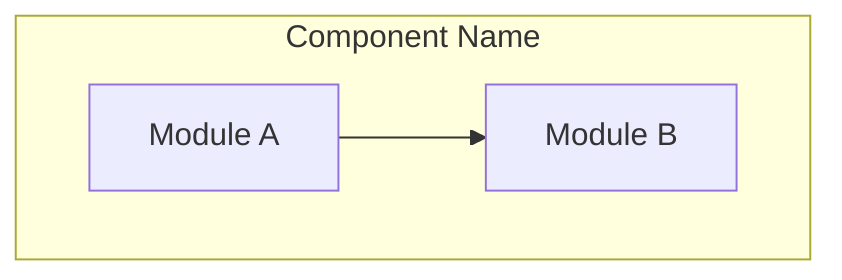
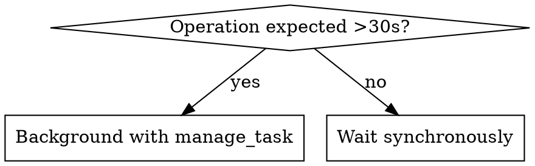
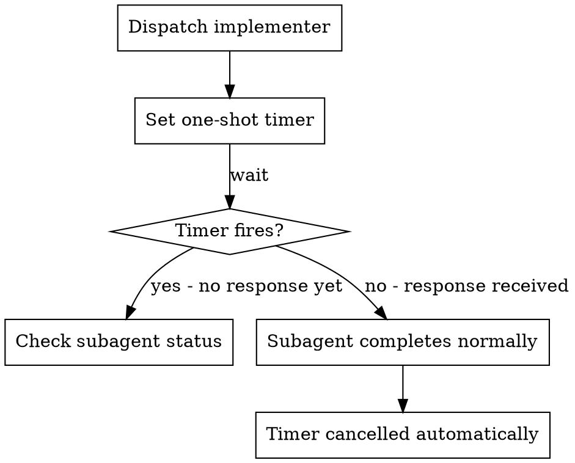

# Core Enhancements Implementation Plan

> **For agentic workers:** REQUIRED SUB-SKILL: Use superpowers:subagent-driven-development to implement this plan task-by-task. Steps use checkbox (`- [ ]`) syntax for tracking.

**Goal:** Upgrade 3 existing skills and create 1 new skill to leverage native Antigravity 2.0 capabilities (`generate_image`, rich artifacts, `manage_task`, `send_message`, `schedule`, browser automation).

**Architecture:** Each task modifies or creates a single SKILL.md file. Changes are additive — no existing behavior is removed. Each task follows writing-skills TDD: RED (baseline subagent test) → GREEN (edit/create skill) → REFACTOR (close loopholes).

**Tech Stack:** Markdown skill files, subagent pressure testing, Antigravity native tools.

**Design Spec:** `docs/superpowers/specs/2026-06-10-core-enhancements-design.md`

---

### Task 1: Visual Brainstorming Enhancement

**Files:**
- Modify: `skills/brainstorming/SKILL.md`

- [ ] **Step 1: RED — Baseline test**

Dispatch a subagent with this pressure scenario (WITHOUT any skill changes — testing current behavior):

```
You are brainstorming a dashboard UI for a project management tool. The user wants:
- A kanban board with drag-and-drop columns
- A sidebar with project navigation
- A header with search and notifications

You have access to `generate_image` to create mockups. The user says:
"Can you show me what the dashboard layout could look like? I'm torn between a sidebar layout and a top-nav layout."

Brainstorm this with the user. Show them visual options.
```

Document: Does the agent use `generate_image`? Does it embed images in artifacts? Does it create comparison views? Does it ask for consent before generating images?

- [ ] **Step 2: GREEN — Update checklist step 2 and flowchart**

In `skills/brainstorming/SKILL.md`, replace the checklist item on line 26:

```markdown
# BEFORE (line 26):
2. **Offer visual companion** (if topic will involve visual questions) — this is its own message, not combined with a clarifying question. See the Visual Companion section below.

# AFTER:
2. **Assess visual needs** — note whether upcoming questions have visual aspects. If so, use `generate_image` for mockups and diagrams as you go. No consent needed — this is a native tool, not a browser session.
```

Also update the Graphviz flowchart (lines 37-64) to match. Replace the `"Visual questions ahead?"` diamond and `"Offer Visual Companion\n(own message, no other content)"` node with a single `"Assess visual needs"` box. The flow becomes:

```dot
"Explore project context" -> "Assess visual needs";
"Assess visual needs" -> "Ask clarifying questions";
```

Remove the yes/no branching — visual assessment is now always done (it's a note, not a gate).

- [ ] **Step 3: GREEN — Expand Visual Companion section**

Replace the Visual Companion section (lines 149-163) with:

```markdown
## Visual Companion

When brainstorming involves visual questions, use native Antigravity tools directly:

**Generating mockups:**
- Use `generate_image` with specific, descriptive prompts. Include layout details, color schemes, element placement.
- Bad prompt: "dashboard mockup"
- Good prompt: "Modern project management dashboard with dark theme. Left sidebar with project list and icons. Main area shows a kanban board with 4 columns (Backlog, In Progress, Review, Done). Header bar with search field and notification bell. Clean, minimal design with subtle shadows."

**Comparisons:**
- Generate 2-3 alternatives when presenting design options
- Embed in an artifact using a carousel for side-by-side review:
  ````carousel
  
  <!-- slide -->
  
  ````

**Per-question decision:** For each question, decide whether visual or text is better:
- **Use `generate_image`** for content that IS visual — mockups, wireframes, layout comparisons, architecture diagrams
- **Use text** for content that is text — requirements questions, conceptual choices, tradeoff lists, scope decisions

A question about a UI topic is not automatically a visual question. "What does personality mean in this context?" is conceptual — use text. "Which wizard layout works better?" is visual — use `generate_image`.
```

- [ ] **Step 4: GREEN — Verify with same scenario**

Re-dispatch the same subagent scenario from Step 1, now with the updated skill loaded. Verify:
- Agent uses `generate_image` without asking for consent
- Agent generates multiple mockup alternatives
- Agent embeds images in artifacts
- Agent uses carousel for comparisons

- [ ] **Step 5: REFACTOR — Close loopholes**

Review subagent behavior from Step 4. If the agent:
- Still asks for consent → add explicit "No consent needed" to the section
- Generates only one mockup → add "Always generate 2+ options when presenting alternatives"
- Doesn't embed in artifacts → add explicit embedding instruction

Fix any issues found. Re-test if changes were needed.

- [ ] **Step 6: Word count check**

```bash
wc -w skills/brainstorming/SKILL.md
```

Target: <500 words for the visual companion section specifically. Total file should stay reasonable.

- [ ] **Step 7: Commit**

```bash
git add skills/brainstorming/SKILL.md
git commit -m "feat(brainstorming): integrate generate_image for visual companion"
```

---

### Task 2: Rich Artifacts — writing-plans Enhancement

**Files:**
- Modify: `skills/writing-plans/SKILL.md`

- [ ] **Step 1: RED — Baseline test**

Dispatch a subagent with this scenario (WITHOUT skill changes):

```
You are writing an implementation plan for a REST API with 3 endpoints (users, projects, tasks). The API uses Express.js with PostgreSQL.

Write the plan following the writing-plans skill. Save it to docs/superpowers/plans/test-api-plan.md.
```

Document: Does the plan include a Mermaid architecture diagram? Does it use file links? Does it use GitHub alerts for critical requirements? Does it use diff blocks?

- [ ] **Step 2: GREEN — Add Mermaid diagram requirement to plan header**

In `skills/writing-plans/SKILL.md`, after the `**Architecture:** [2-3 sentences about approach]` line (line 56), add:

```markdown
**Architecture Diagram:**



Include a Mermaid diagram showing component relationships and data flow. This diagram should match the architecture description above.
```

- [ ] **Step 3: GREEN — Add rich formatting guidance**

After the "Remember" section (line 121), add a new section:

```markdown
## Rich Formatting

Use Antigravity's artifact formatting to make plans scannable:

- **File links:** Always use clickable links: `[filename](file:///absolute/path/to/file)` or `[function](file:///path/to/file#L10-L20)`
- **Diff blocks:** Show code changes as diffs when modifying existing files:
  ```diff
  -old_function_name()
  +new_function_name()
   unchanged_line()
  ```
- **GitHub alerts:** Flag critical requirements and breaking changes:
  > [!IMPORTANT]
  > This change requires a database migration

- **Mermaid diagrams:** Use in the architecture section and for complex data flows within tasks
```

- [ ] **Step 4: GREEN — Verify with same scenario**

Re-dispatch the same scenario from Step 1 with the updated skill. Verify the plan now includes:
- A Mermaid architecture diagram in the header
- File links for all referenced files
- Diff blocks where code changes are shown
- GitHub alerts for critical items

- [ ] **Step 5: REFACTOR — Close loopholes**

Review and fix any gaps. Common issues:
- Agent puts Mermaid diagram but it doesn't match the architecture text
- Agent uses file links but with relative paths instead of absolute
- Agent skips diff blocks for "simple" changes

- [ ] **Step 6: Word count check**

```bash
wc -w skills/writing-plans/SKILL.md
```

- [ ] **Step 7: Commit**

```bash
git add skills/writing-plans/SKILL.md
git commit -m "feat(writing-plans): add Mermaid diagrams and rich artifact formatting"
```

---

### Task 3: Rich Artifacts — executing-plans to Workspace

**Files:**
- Create: `skills/executing-plans/SKILL.md`

- [ ] **Step 1: RED — Baseline test**

Dispatch a subagent with this scenario (WITHOUT executing-plans in the workspace):

```
You have a written implementation plan at docs/superpowers/plans/test-plan.md with 3 tasks. You are executing it inline (no subagents available).

You've just completed all 3 tasks and verified they pass. What do you do next?
```

Document: Does the agent create a walkthrough artifact? Does it use `write_to_file` with artifact metadata? Does it invoke finishing-a-development-branch? Or does it just say "done" without summary?

- [ ] **Step 2: Copy from installed plugin**

Note: This is a cross-filesystem copy (Windows plugin dir → WSL workspace). Use the appropriate copy mechanism for the execution environment.

```bash
mkdir -p skills/executing-plans
cp ~/.gemini/config/plugins/superpowers/skills/executing-plans/SKILL.md skills/executing-plans/SKILL.md
```

- [ ] **Step 3: GREEN — Remove legacy multi-platform reference**

Replace line 14:

```markdown
# BEFORE:
**Note:** Tell your human partner that Superpowers works much better with access to subagents. The quality of its work will be significantly higher if run on a platform with subagent support (such as Claude Code or Codex). If subagents are available, use superpowers:subagent-driven-development instead of this skill.

# AFTER:
**Note:** This skill is for environments without subagent support. If subagents are available, use superpowers:subagent-driven-development instead — it provides higher quality through fresh-context-per-task and two-stage review.
```

- [ ] **Step 4: GREEN — Replace TodoWrite and legacy language**

Search for and replace all legacy references:
- `TodoWrite` → `task.md artifact` (using `write_to_file` with `IsArtifact: true, ArtifactType: "task"`)
- `human partner` → `user` (throughout the file)
- `Partner` → `User` (when referring to the human, e.g. "Partner updates the plan")

- [ ] **Step 5: GREEN — Replace Step 3 with walkthrough generation**

Replace the existing `### Step 3: Complete Development` section (which only has finishing-a-development-branch) with an expanded version:

```markdown
### Step 3: Complete Development

After all tasks complete and verified:
1. **Generate walkthrough artifact:** Create a `walkthrough.md` artifact summarizing:
   - What was implemented (list of changes per component)
   - What was tested and results
   - Embed any relevant screenshots or recordings
   - Use file links to point to key changed files

2. **Finish the branch:**
   - Announce: "I'm using the finishing-a-development-branch skill to complete this work."
   - **REQUIRED SUB-SKILL:** Use superpowers:finishing-a-development-branch
   - Follow that skill to verify tests, present options, execute choice
```

- [ ] **Step 6: Verify no legacy references remain**

```bash
grep -i "claude\|codex\|cursor\|opencode\|copilot\|gemini cli\|TodoWrite\|Skill tool\|human partner" skills/executing-plans/SKILL.md
```

Expected: No matches.

- [ ] **Step 7: GREEN — Verify with same scenario**

Re-dispatch the same scenario from Step 1 with executing-plans now in the workspace. Verify:
- Agent creates a walkthrough artifact after completing tasks
- Agent invokes finishing-a-development-branch
- Agent uses `write_to_file` with artifact metadata (not TodoWrite)

- [ ] **Step 8: REFACTOR — Close loopholes**

Review subagent behavior from Step 7. Fix any gaps found. Re-test if changes were needed.

- [ ] **Step 9: Word count check**

```bash
wc -w skills/executing-plans/SKILL.md
```

- [ ] **Step 10: Commit**

```bash
git add skills/executing-plans/SKILL.md
git commit -m "feat(executing-plans): add to workspace, remove legacy refs, add walkthrough generation"
```

---

### Task 4: Asynchronous Subagents — SDD Enhancement

**Files:**
- Modify: `skills/subagent-driven-development/SKILL.md`

- [ ] **Step 1: RED — Baseline test**

Dispatch a subagent with this scenario (WITHOUT skill changes):

```
You are using subagent-driven-development to execute a plan. Task 3 involves running a full test suite that takes 2 minutes. Task 4 is independent and doesn't depend on Task 3's results.

You just dispatched the implementer for Task 3. It's running the test suite now. What do you do while waiting?

Also, the implementer for Task 2 just asked a clarifying question about the API format. How do you respond to them?
```

Document: Does the agent use `manage_task` for background operations? Does it use `send_message` to respond to the running subagent? Does it set a timeout?

- [ ] **Step 2: GREEN — Add Background Task Management section**

After the "Model Selection" section (line 103), add:

```markdown
## Background Task Management

When implementers run long-running operations (builds, test suites, deployments), use `manage_task` instead of blocking:

**For operations expected to take >30 seconds:**
- Implementer should use `run_command` with a short `WaitMsBeforeAsync` (e.g., 500ms) to background it
- Use `manage_task` with `status` to check on completion when notified
- Don't poll in a loop — the system automatically notifies when tasks finish
- Use `manage_task` with `kill` to terminate stuck processes

**When to background vs. wait:**


```

- [ ] **Step 3: GREEN — Add Agent Communication section**

After the new Background Task Management section, add:

```markdown
## Agent Communication

Use `send_message` to communicate with running subagents:

**Answering questions mid-flight:**
- When an implementer asks a question while still running, use `send_message` with the implementer's conversation ID
- Don't re-dispatch a new subagent just to answer a question — the original implementer has context

**Providing additional context:**
- If you realize an implementer needs more information after dispatch, use `send_message` to send it
- The implementer receives it as a message and can incorporate it into their work

**When to use `send_message` vs. re-dispatch:**
- Subagent is still running and needs info → `send_message`
- Subagent reported NEEDS_CONTEXT and stopped → re-dispatch with context
- Subagent reported BLOCKED → assess blocker, possibly re-dispatch with different model
```

- [ ] **Step 4: GREEN — Add Timeout Protection section**

After the Agent Communication section, add:

```markdown
## Timeout Protection

Use `schedule` as a safety net for complex tasks:



- Set a one-shot timer when dispatching implementers for complex tasks (5 minutes for standard tasks, 10 for complex ones)
- If the timer fires before the implementer responds, check status and intervene if needed
- The timer cancels automatically if the implementer responds first — no cleanup needed
```

- [ ] **Step 5: GREEN — Verify with same scenario**

Re-dispatch the same scenario from Step 1 with the updated skill. Verify the agent:
- Uses `manage_task` for the long-running test suite
- Uses `send_message` to answer the running implementer's question
- Sets a timeout for safety

- [ ] **Step 6: REFACTOR — Close loopholes**

Common issues:
- Agent backgrounds everything (even quick operations) → clarify the >30s threshold
- Agent polls `manage_task` in a loop → add explicit "don't poll" warning
- Agent sets timer but doesn't act when it fires → add clear escalation steps

- [ ] **Step 7: Word count check**

```bash
wc -w skills/subagent-driven-development/SKILL.md
```

- [ ] **Step 8: Commit**

```bash
git add skills/subagent-driven-development/SKILL.md
git commit -m "feat(SDD): add manage_task, send_message, and schedule support"
```

---

### Task 5: Browser-Testing Skill (NEW)

**Files:**
- Create: `skills/browser-testing/SKILL.md`

- [ ] **Step 1: RED — Baseline test**

Dispatch a subagent with this scenario (WITHOUT the new skill):

```
You just implemented a login page with a form (email, password, submit button) and a forgot-password link. The page uses a dark theme with a centered card layout.

Verify that the UI looks correct and works as expected. You have access to browser automation tools.
```

Document: Does the agent use browser automation at all? Does it take screenshots? Does it check DOM structure? Does it embed evidence in artifacts? Or does it just say "the UI looks correct" without evidence?

- [ ] **Step 2: GREEN — Create the skill**

Create `skills/browser-testing/SKILL.md`:

```markdown
---
name: browser-testing
description: Use when completing frontend or UI work that needs visual verification, before claiming the UI is correct
---

# Browser Testing

## Overview

Never claim UI work is correct without visual evidence. Browser automation makes verification fast and produces artifacts the user can review.

**Core principle:** Evidence before assertions. Screenshots and DOM inspection prove correctness; text descriptions don't.

**When to use:** After implementing any UI or frontend changes, before claiming the work is correct.

## The Process

1. **Navigate** to the page under test using browser automation
2. **Screenshot** the current state — embed in walkthrough artifact
3. **Inspect DOM** to verify structure matches expectations (correct elements, classes, attributes)
4. **Record a walkthrough** of the key user flow (if multi-step interaction)
5. **Embed evidence** in a walkthrough artifact with screenshots and recordings

## Quick Reference

| What to verify | Tool | Output |
|---------------|------|--------|
| Visual appearance | Screenshot | `` |
| DOM structure | Inspect elements | Element presence, attributes, classes |
| User flow | Recording | Embedded video in artifact |
| Responsive layout | Screenshot at viewport | Multiple screenshots at different widths |

## Common Mistakes

| Mistake | Fix |
|---------|-----|
| Not waiting for page load before screenshot | Wait for key elements to be visible |
| Checking only one viewport size | Test at desktop (1280px) and mobile (375px) minimum |
| Visual-only verification (no DOM check) | Always inspect DOM structure — visual can hide broken markup |
| Forgetting to embed evidence | Every claim needs a screenshot or recording in the artifact |
| Saying "looks correct" without proof | Take the screenshot. Embed it. Let the user judge. |

## Integration

- **superpowers:verification-before-completion** — browser-testing is specialized verification for UI work
- **superpowers:test-driven-development** — browser tests complement unit tests, they don't replace them
```

- [ ] **Step 3: GREEN — Verify with same scenario**

Re-dispatch the same scenario from Step 1 with the new skill loaded. Verify:
- Agent navigates to the login page
- Agent takes a screenshot
- Agent inspects DOM for form elements
- Agent embeds screenshot in an artifact
- Agent does NOT just say "looks correct" without evidence

- [ ] **Step 4: REFACTOR — Close loopholes**

Common rationalizations to watch for:
- "The dev server isn't running, so I can't test" → skill should say to start the dev server first
- "I'll just check the HTML source instead" → source inspection is not visual verification
- "The tests pass so the UI must be correct" → unit tests don't verify visual appearance

Add counters for any rationalizations found.

- [ ] **Step 5: Word count check**

```bash
wc -w skills/browser-testing/SKILL.md
```

Target: <500 words.

- [ ] **Step 6: Commit**

```bash
git add skills/browser-testing/SKILL.md
git commit -m "feat: add browser-testing skill for UI verification"
```
