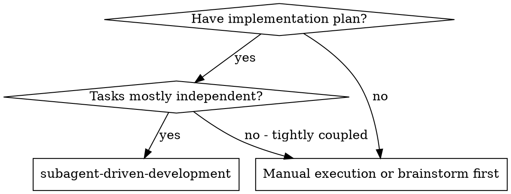
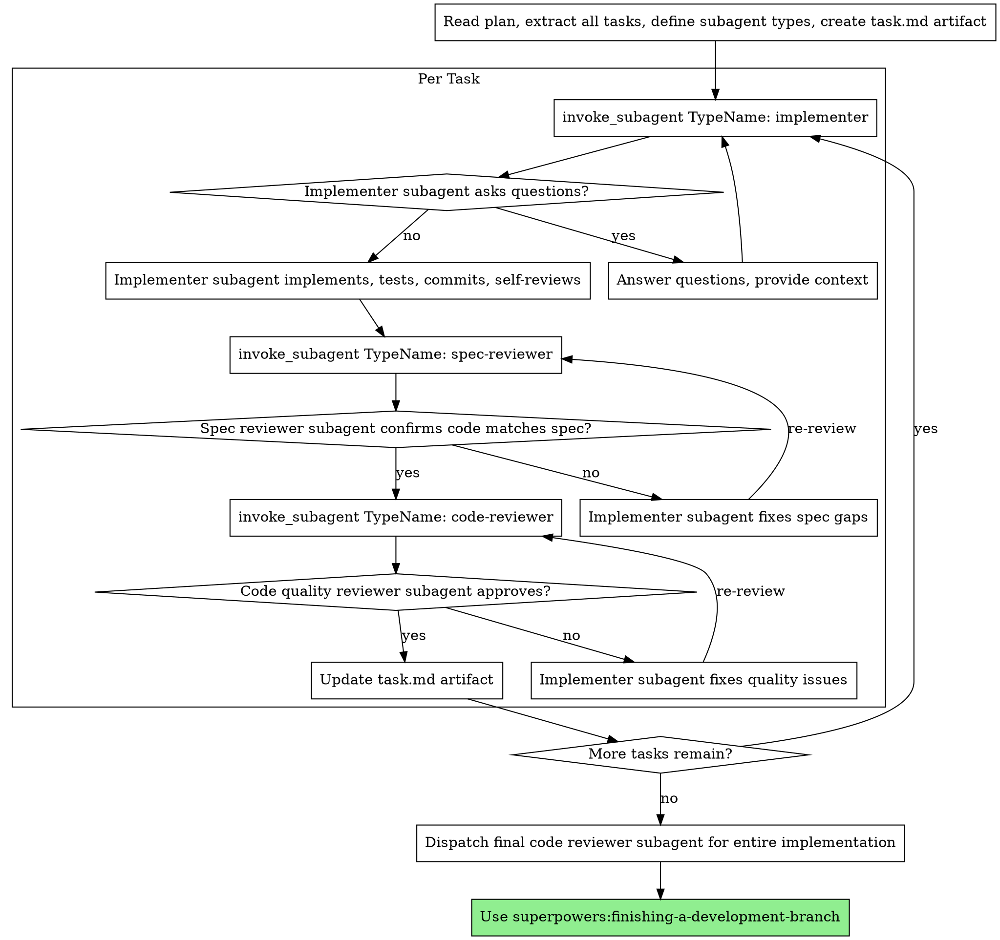
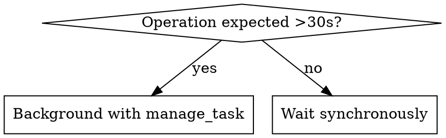
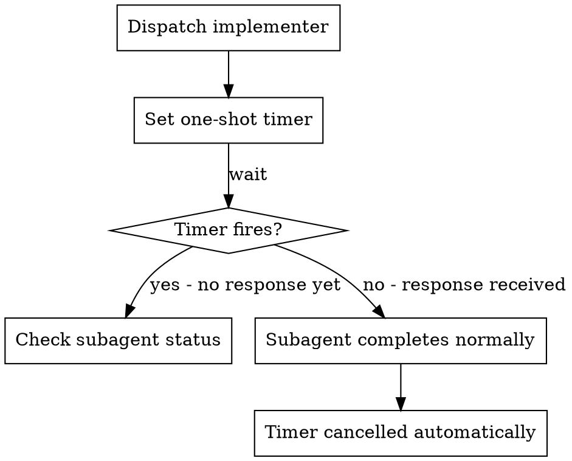

# Subagent-Driven Development

Execute plan by dispatching fresh subagent per task, with two-stage review after each: spec compliance review first, then code quality review.

**Why subagents:** You delegate tasks to specialized agents with isolated context. By precisely crafting their instructions and context, you ensure they stay focused and succeed at their task. They should never inherit your session's context or history — you construct exactly what they need. This also preserves your own context for coordination work.

**Core principle:** Fresh subagent per task + two-stage review (spec then quality) = high quality, fast iteration

**Continuous execution:** Do not pause to check in with your human partner between tasks. Execute all tasks from the plan without stopping. The only reasons to stop are: BLOCKED status you cannot resolve, ambiguity that genuinely prevents progress, or all tasks complete. "Should I continue?" prompts and progress summaries waste their time — they asked you to execute the plan, so execute it.

## When to Use



## The Process



## Subagent Type Setup

At the start of plan execution, **before dispatching any tasks**, define all three subagent types:

1. `define_subagent` with name `"implementer"` — read `./implementer-prompt.md` for the static system prompt
2. `define_subagent` with name `"spec-reviewer"` — read `./spec-reviewer-prompt.md` for the static system prompt
3. `define_subagent` with name `"code-reviewer"` — read `./code-reviewer.md` (in `requesting-code-review/`) for the static system prompt

This pays the prompt cost once. Every subsequent `invoke_subagent` with these types reuses the cached definition.

**Workspace isolation per role:**

| Role | Workspace Mode | Why |
|------|---------------|-----|
| Implementer | `Workspace: "branch"` | Needs isolated write access |
| Spec reviewer | `Workspace: "inherit"` | Read-only — only inspects code |
| Code reviewer | `Workspace: "inherit"` | Read-only — only inspects code |

## Model Selection

Use the least powerful model that can handle each role to conserve cost and increase speed.

**Mechanical implementation tasks** (isolated functions, clear specs, 1-2 files): use a fast, cheap model. Most implementation tasks are mechanical when the plan is well-specified.

**Integration and judgment tasks** (multi-file coordination, pattern matching, debugging): use a standard model.

**Architecture, design, and review tasks**: use the most capable available model.

**Task complexity signals:**
- Touches 1-2 files with a complete spec → cheap model
- Touches multiple files with integration concerns → standard model
- Requires design judgment or broad codebase understanding → most capable model

## Handling Implementer Status

Implementer subagents report one of four statuses. Handle each appropriately:

**DONE:** Proceed to spec compliance review.

**DONE_WITH_CONCERNS:** The implementer completed the work but flagged doubts. Read the concerns before proceeding. If the concerns are about correctness or scope, address them before review. If they're observations (e.g., "this file is getting large"), note them and proceed to review.

**NEEDS_CONTEXT:** The implementer needs information that wasn't provided. Provide the missing context and re-dispatch.

**BLOCKED:** The implementer cannot complete the task. Assess the blocker:
1. If it's a context problem, provide more context and re-dispatch with the same model
2. If the task requires more reasoning, re-dispatch with a more capable model
3. If the task is too large, break it into smaller pieces
4. If the plan itself is wrong, escalate to the user

**Never** ignore an escalation or force the same model to retry without changes. If the implementer said it's stuck, something needs to change.

## Background Task Management

When implementers run long-running operations (builds, test suites, deployments), use `manage_task` instead of blocking:

**For operations expected to take >30 seconds:**
- Implementer should use `run_command` with a short `WaitMsBeforeAsync` (e.g., 500ms) to background it
- Use `manage_task` with `status` to check on completion when notified
- Don't poll in a loop — the system automatically notifies when tasks finish
- Use `manage_task` with `kill` to terminate stuck processes

**When to background vs. wait:**



## Agent Communication

Use `send_message` to communicate with running subagents:

**Answering questions mid-flight:**
- When an implementer asks a question while still running, use `send_message` with the implementer's conversation ID
- Don't re-dispatch a new subagent just to answer a question — the original implementer has context

**Providing additional context:**
- If you realize an implementer needs more information after dispatch, use `send_message` to send it
- The implementer receives it as a message and can incorporate it into their work

**When to use `send_message` vs. re-dispatch:**
- Subagent is still running and needs info → `send_message`
- Subagent reported NEEDS_CONTEXT and stopped → re-dispatch with context
- Subagent reported BLOCKED → assess blocker, possibly re-dispatch with different model

## Timeout Protection

Use `schedule` as a safety net for complex tasks:



- Set a one-shot timer when dispatching implementers for complex tasks (5 minutes for standard tasks, 10 for complex ones)
- If the timer fires before the implementer responds, check status and intervene if needed
- The timer cancels automatically if the implementer responds first — no cleanup needed

**For test suites expected to take 5+ minutes**, use a recurring schedule instead of a one-shot timer:
```
schedule(CronExpression: "*/2 * * * *", MaxIterations: "5", Prompt: "Check implementer status for Task N")
```

## Subagent Monitoring

Use `manage_subagents` to track running subagents:

- `Action: "list"` — check which subagents are still running before dispatching the next task
- `Action: "kill"` — terminate stuck subagents that haven't responded after timeout

Don't poll in a loop — the system notifies you when subagents complete. Use `manage_subagents` only when you need an explicit status check (e.g., before cleanup or when a timer fires).

## Prompt Templates

- `./implementer-prompt.md` — `define_subagent` definition (static system prompt + dynamic prompt template)
- `./spec-reviewer-prompt.md` — `define_subagent` definition (static system prompt + dynamic prompt template)
- `./code-quality-reviewer-prompt.md` — Delegates to `code-reviewer` type with extra review criteria
- `requesting-code-review/code-reviewer.md` — `define_subagent` definition (static system prompt + dynamic prompt template)

## Example Workflow

```
You: I'm using Subagent-Driven Development to execute this plan.

[Read plan file once: docs/superpowers/plans/feature-plan.md]
[Extract all 5 tasks with full text and context]
[define_subagent "implementer" — static system prompt from implementer-prompt.md]
[define_subagent "spec-reviewer" — static system prompt from spec-reviewer-prompt.md]
[define_subagent "code-reviewer" — static system prompt from code-reviewer.md]
[Create task.md artifact with all tasks]

Task 1: Hook installation script

[Get Task 1 text and context (already extracted)]
[invoke_subagent TypeName: "implementer" with task text + context in Prompt]

Implementer: "Before I begin - should the hook be installed at user or system level?"

You: "User level (~/.config/superpowers/hooks/)"

Implementer: "Got it. Implementing now..."
[Later] Implementer:
  - Implemented install-hook command
  - Added tests, 5/5 passing
  - Self-review: Found I missed --force flag, added it
  - Committed

[invoke_subagent TypeName: "spec-reviewer"]
Spec reviewer: ✅ Spec compliant - all requirements met, nothing extra

[invoke_subagent TypeName: "code-reviewer"]
Code reviewer: Strengths: Good test coverage, clean. Issues: None. Approved.

[Update task.md: mark Task 1 complete]

Task 2: Recovery modes

[Get Task 2 text and context (already extracted)]
[invoke_subagent TypeName: "implementer" with task text + context in Prompt]

Implementer: [No questions, proceeds]
Implementer:
  - Added verify/repair modes
  - 8/8 tests passing
  - Self-review: All good
  - Committed

[invoke_subagent TypeName: "spec-reviewer"]
Spec reviewer: ❌ Issues:
  - Missing: Progress reporting (spec says "report every 100 items")
  - Extra: Added --json flag (not requested)

[Implementer fixes issues]
Implementer: Removed --json flag, added progress reporting

[Spec reviewer reviews again]
Spec reviewer: ✅ Spec compliant now

[invoke_subagent TypeName: "code-reviewer"]
Code reviewer: Strengths: Solid. Issues (Important): Magic number (100)

[Implementer fixes]
Implementer: Extracted PROGRESS_INTERVAL constant

[Code reviewer reviews again]
Code reviewer: ✅ Approved

[Update task.md: mark Task 2 complete]

...

[After all tasks]
[Dispatch final code-reviewer]
Final reviewer: All requirements met, ready to merge

Done!
```

## Advantages

**vs. Manual execution:**
- Subagents follow TDD naturally
- Fresh context per task (no confusion)
- Parallel-safe (subagents don't interfere)
- Subagent can ask questions (before AND during work)

**Efficiency gains:**
- No file reading overhead (controller provides full text)
- Controller curates exactly what context is needed
- Subagent gets complete information upfront
- Questions surfaced before work begins (not after)

**Quality gates:**
- Self-review catches issues before handoff
- Two-stage review: spec compliance, then code quality
- Review loops ensure fixes actually work
- Spec compliance prevents over/under-building
- Code quality ensures implementation is well-built

**Cost:**
- More subagent invocations (implementer + 2 reviewers per task)
- Controller does more prep work (extracting all tasks upfront)
- Review loops add iterations
- But catches issues early (cheaper than debugging later)

## Red Flags

**Never:**
- Start implementation on main/master branch without explicit user consent
- Skip reviews (spec compliance OR code quality)
- Proceed with unfixed issues
- Dispatch multiple implementation subagents in parallel (conflicts)
- Make subagent read plan file (provide full text instead)
- Skip scene-setting context (subagent needs to understand where task fits)
- Ignore subagent questions (answer before letting them proceed)
- Accept "close enough" on spec compliance (spec reviewer found issues = not done)
- Skip review loops (reviewer found issues = implementer fixes = review again)
- Let implementer self-review replace actual review (both are needed)
- **Start code quality review before spec compliance is ✅** (wrong order)
- Move to next task while either review has open issues

**If subagent asks questions:**
- Answer clearly and completely
- Provide additional context if needed
- Don't rush them into implementation

**If reviewer finds issues:**
- Implementer (same subagent) fixes them
- Reviewer reviews again
- Repeat until approved
- Don't skip the re-review

**If subagent fails task:**
- Dispatch fix subagent with specific instructions
- Don't try to fix manually (context pollution)

## Integration

**Required workflow skills:**
- **superpowers:using-git-worktrees** - Ensures isolated workspace (creates one or verifies existing)
- **superpowers:writing-plans** - Creates the plan this skill executes
- **superpowers:requesting-code-review** - Code review template for reviewer subagents
- **superpowers:finishing-a-development-branch** - Complete development after all tasks

**Subagents should use:**
- **superpowers:test-driven-development** - Subagents follow TDD for each task

